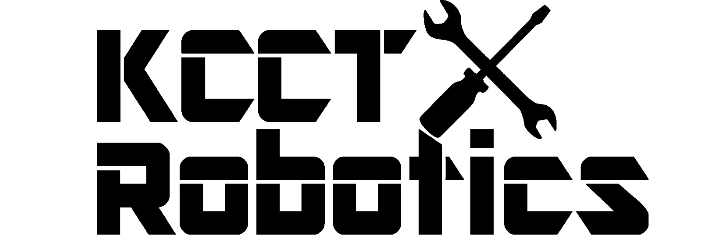

# ようこそ、神戸高専ロボ研OPEN-Wikiへ
このサイトは神戸高専ロボ研の現役とOB間での情報共有ツールであり、未来に残すノウハウを残すために作られています。

{ align=left }

## 使い方
    - 詳細追記
## 項目
### [機械班](https://KCCTRobotics-OBs.github.io/KCCTR-Wiki/Mech/)
- [SOLIDWORKS](https://KCCTRobotics-OBs.github.io/KCCTR-Wiki/Mech/SOLIDWORKS)
- [DATA](https://KCCTRobotics-OBs.github.io/KCCTR-Wiki/Mech/M-Data)

### [電気班](https://KCCTRobotics-OBs.github.io/KCCTR-Wiki/Electric/)
- [DATA](https://KCCTRobotics-OBs.github.io/KCCTR-Wiki/Electric/E-Data)

### [Git]()
### [FAQ](https://KCCTRobotics-OBs.github.io/KCCTR-Wiki/FAQ)
- [質問を投げたい時](https://github.com/miyamiyamon/faq2answer/issues/new?assignees=&labels=&projects=KobeKosenRobotics%2F6&template=faq-form.yaml&title=%5BFAQ%5D%EF%BC%9A)
- [質問回答について（OB向け）](https://KCCTRobotics-OBs.github.io/KCCTR-Wiki/FAQ/OB/)